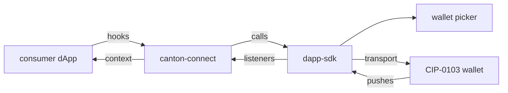

# Architecture: canton-connect

What the package is and how to use it: [`README.md`](README.md). This file maps the seams. Two
subsystems carry their own chapter:
[`architecture/connection-machine.md`](architecture/connection-machine.md) for the states and what
settles each promise, and [`architecture/popup-close-guard.md`](architecture/popup-close-guard.md)
for the SDK bug the guard works around.

## Project structure

```
src/
  machine/
    connectionMachine.ts    the lifecycle; owns the sdk, account, status and the last error
    connectionActors.ts     init / connect / restore / disconnect / walletEvents
    accountsMachine.ts      the account read, invoked inside session.authenticated
    accountsActors.ts       listAccounts reader and accountsChanged listener
  CantonConnectProvider/
    index.tsx               the context: publishes the actor and four actions
    useConnectionActor.ts   creates the actor, sends the boot restore
    useConnectBridge.ts     connect() as a promise over the machine's tags
    useDisconnectBridge.ts  disconnect() as a promise over the machine's tags
    adapters.ts             buildAdditionalAdapters
  hooks/                    the seven public hooks, plus useTxFeed and useWalletCall
  mock/mockAdapter.ts       createMockAdapter, a ProviderAdapter for dev and tests
  testing/                  the ./testing doubles, plus suite-local helpers
  connectError.ts           ConnectCancelledError, PickerClosedError, toConnectError
  guardedConnect.ts         sdk.connect() with a closed-popup watchdog
  types.ts                  Account, ConnectionStatus, CantonConnectConfig, DappSdkMethods, context value
  index.ts                  public exports
```

## Who talks to whom



| edge | what crosses it |
|---|---|
| calls | `init`, `connect`, `disconnect`, `status`, `listAccounts` from the machine's actors; `signMessage`, `prepareExecuteAndWait`, `ledgerApi` from the hooks |
| transport | extension postMessage, WalletConnect, remote gateway |
| pushes | `statusChanged`, `accountsChanged`, `txChanged` |
| listeners | `onStatusChanged`, `onAccountsChanged`, `onTxChanged` |
| context | one `CantonConnectContextValue` |

## Seams

### The lifecycle: `machine/`

One model of connecting, session, lock and disconnect, so the impossible combinations (an account
with no live session, an error beside a live session) cannot be built. Three decisions carry the weight:

- `idle` is not `disconnected`. `idle` means the boot restore has not answered; `disconnected` means
  it has, and there is nothing.
- `account` is cleared on leaving `session.authenticated`, so a wallet that will not serve requests
  publishes none. The session itself stays, which keeps the wallet listener alive: an unlock is
  heard and the account is read again with no reconnect.
- The account read is a child machine, so a failed read cannot end the session; only the promise
  carries the failure.

### The bridges

`connect()` and `disconnect()` are a send plus a wait on a tag, so the promise over a transition
lives outside the machine. Neither passes a timeout. The connect wait has no clock on purpose, since
a wallet login can take as long as it takes; it ends when the wallet answers or the user cancels
(`connect.cancel`). The disconnect wait the machine bounds itself, giving up on a wallet 10 s silent
(`DISCONNECT_TIMEOUT_MS`), since nobody is deciding anything in that window.

### The provider publishes, the hooks select

The context value is the config, the actor as `ConnectionSubscription` (`send` is unreachable
through it, so the bridges stay the only senders) and four identity-stable actions. Each hook
selects its own slice, which is wagmi's shape: `WagmiProvider` publishes, `useAccount` subscribes
itself. `useConnect`, `useDisconnect`, `useAccount` and `useWalletStatus` read session state;
`useLedger`, `useExecute`, `useSignMessage` and `usePartyType` select a guard plus the sdk and
call it directly, never entering the machine.

The machine's input is read once, when the actor is created, so a changed `config` prop needs a
remount. One accepted cost: `sdk` in context makes the snapshot unserializable, which rules out
`getPersistedSnapshot`.

### The picker, and the close guard around it

`CantonConnectConfig.walletPicker` decides the picker: omitted, the SDK's popup; injected, a custom
one (`createAutoPicker` in tests). It is fixed at `new DappSDK()`, which is why the provider hands
the machine a `createSdk` closure rather than an instance.

With the SDK popup in use, `guardedConnect` wraps `sdk.connect()` with a watchdog on the popup
window, because the SDK misses a close (#49). A caught close rejects with `PickerClosedError`, which
takes the machine to `retiring`, where the `DappSDK` is replaced. `cancelConnect` lands there too:
the guard closes the popup itself, off the abort xstate fires when it stops the connect actor.

### Adapters

`buildAdditionalAdapters` assembles what `sdk.init` registers beyond the auto-discovered extensions:
a `WalletConnectAdapter` when `walletConnectProjectId` is set, plus `config.additionalAdapters`. The
init actor passes `defaultAdapters: []`, dropping the SDK's bundled `localhost:3030` dev gateway.
`networkId` (default `'canton:local'`) is the WalletConnect `chainId`. A wallet reporting no
network on an account is not corrected: `Account` carries what it reported.

### Remote gateway

Configured like any adapter: `additionalAdapters: [new RemoteAdapter({ name, rpcUrl })]`, with
`RemoteAdapter` imported from `dapp-sdk`. Connect, restore, disconnect and execute reach a gateway
with no change to this package, and the popup-close guard behaves as it does on an extension. The
flow itself (login page, status push, review page) is the SDK's:
https://docs.canton.network/sdks-tools/sdks/dapp-sdk/wallet-providers/remote-wallet.md.

What differs on a gateway:

- Restore after a reload works only for a gateway registered through `additionalAdapters` at init:
  `RemoteAdapter.restore()` matches the stored discovery URL against a registered `rpcUrl`, so a URL
  the user typed into the SDK picker has nothing to match next time.
- No lock: a gateway has none, so `useWalletStatus().isLocked` never turns true.
- `ledgerApi` must name the route as a template with the values in `path`; a route with the value
  written in is refused. See [Ledger reads](#ledger-reads).

### WalletConnect

`walletConnectProjectId` is what makes `buildAdditionalAdapters` build the SDK's
`WalletConnectAdapter` (Adapters above). Execute, disconnect and the popup-close guard behave as on
an extension. Pairing and requests are the SDK's:
https://docs.canton.network/sdks-tools/sdks/dapp-sdk/wallet-providers/walletconnect.md.

What differs over WalletConnect:

- Restore after a reload is silent: the sign client persists the session.
- No lock reaches the dApp: `useWalletStatus().isLocked` never turns true, and a request sent to a
  locked wallet waits.
- `networkId` is the CAIP-2 chain id of the network the dApp targets: a wallet on another network
  cannot pair, and the default `canton:local` is a local participant, so a dApp on devnet or mainnet
  sets it.

### Ledger reads

`ledgerApi` names its route the way Canton's JSON API OpenAPI does: templated, with the variable
parts in `path`, never written into the string. It is the shape the SDK's own client sends, and the
only one a gateway accepts.

```text
resource: '/v2/users/{user-id}/rights', path: { 'user-id': userId }   // the SDK's shape
resource: `/v2/users/${userId}/rights`                                // a gateway refuses this
```

`query` holds query parameters, `body` the request body; neither goes into `resource`.

### The party type

A party under the hosting participant's namespace is local, any other is external. A dApp cares
because the reference gateway refuses `signMessage` for a local party. CIP-0103 has no field for
it, so `usePartyType().readPartyType` derives it when the consumer asks, never in the machine: one
`ledgerApi` read of the participant id (`GET /v2/parties/participant-id`, open to a `CanActAs`
token), its namespace compared with `Account.namespace`, which arrives from the wallet unchanged, as
`signingProviderId` does. A failed read rejects; what follows is the consumer's call. `isLocal` on
the parties endpoint means hosted here, external parties included, so it is not the signal.

### Testing doubles

`createFakeWallet` is a real CIP-0103 extension over `postMessage`, so a test walks the SDK's own
announce, detect and connect path. `createAutoPicker` answers the picker headlessly, and
`FakeSessionProvider` rehydrates the machine at an asked-for state with no SDK behind it.

## Deferred

- Themed in-page picker (#50): its PR (#63) was closed unmerged, so the SDK popup is still the only
  picker; a new attempt starts from the `walletPicker` seam.

For the stack around this package: the root [`architecture.md`](../architecture.md).
