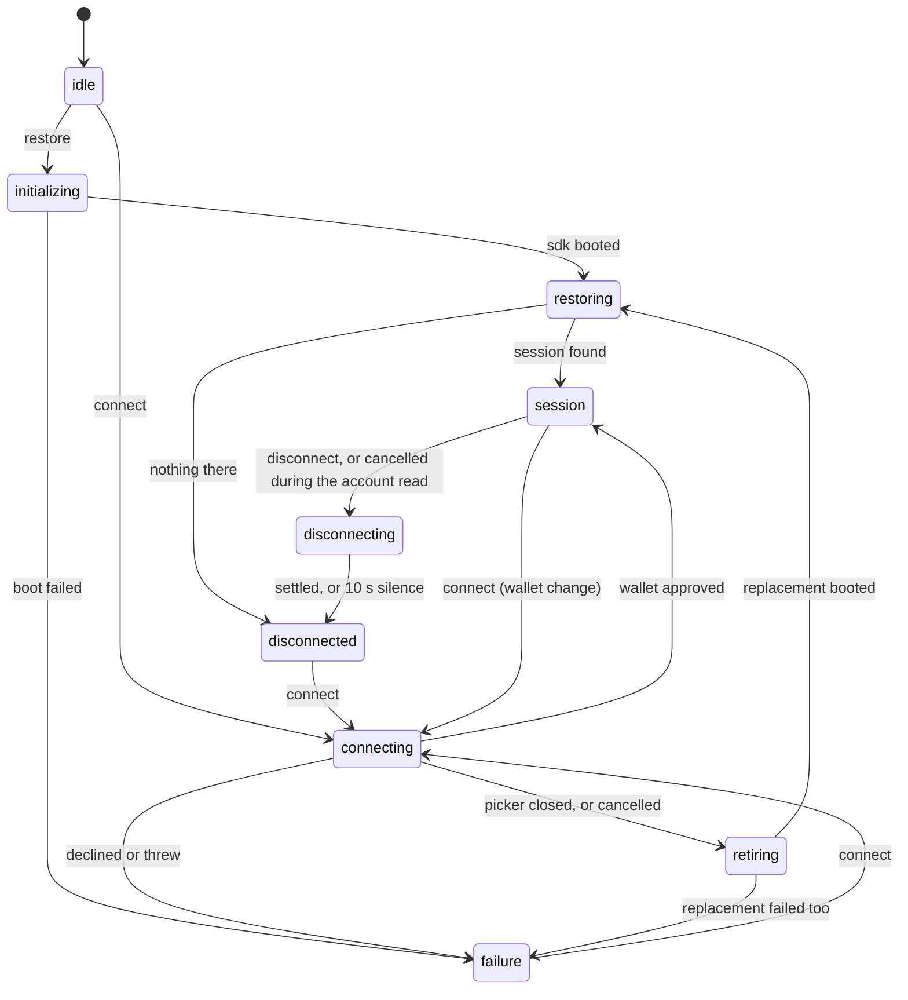
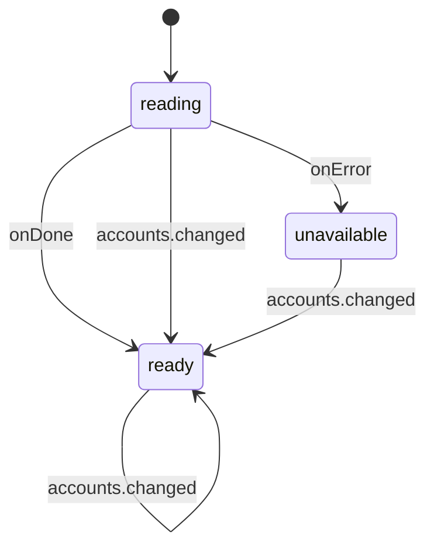

# The connection machine

`machine/connectionMachine.ts` is the source of truth: the states, events, tags and actors are its
`setup()` and config, and every per-state why rides beside its line as a comment. This chapter
holds what the file cannot say from inside one state: the shape at a glance, and the contracts the
bridges and hooks build on top of it. It keeps no per-state inventory on purpose; read the machine.

## The spine

`connecting`, `retiring` and `restoring` each split into `new` and `changing`: the variants carry
whether a standing session is at stake. A connect from `session` runs as
`changing`, and a closed picker or a cancel resumes that session through `retiring.changing` and
`restoring.changing`, which `toConnectionStatus` reports as `'connecting'` rather than
`'disconnected'` and `'idle'`: a consumer gating on status must not unmount the app while its
session is on the way back.

`session` holds `unauthenticated` (the wallet will not serve requests) and `authenticated`, whose
substates mirror the accounts child: `reading`, `ready`, `unavailable`. Entry always targets
`authenticated`; only a wallet push moves between the two.

`restore` is not only the boot event: `disconnected`, `failure` and a standing `session` (one whose
sdk was replaced under it) all take it back to `initializing`.

## What consumers stand on

The tags are the machine's public face; the bridges and hooks read nothing else.

- `connect()` sends the event and waits: `connect.settled` resolves it, `connect.failed` rejects
  with the recorded error through `toConnectError`, `connect.cancelled` rejects with a fresh
  `ConnectCancelledError`. The wait has no timeout, so a state that answers a connect must carry
  one of the three.
- `disconnect()` waits for `disconnect.settled` the same way.
- Hooks select: `isPending` is `hasTag('connecting')`, `isLocked` is `hasTag('unauthenticated')`,
  `status` is `toConnectionStatus`, `error` is `context.lastConnectError` through
  `toConnectError`.

Consequences a caller notices:

- A connect sent over a standing session goes to the wallet as a wallet change, and after a
  wallet-side disconnect (one indistinguishable push with a lock) it is the only recovery a
  consumer can drive. A change the user walks out on resumes the session it would have replaced.
- A connect during a disconnect is ignored, not queued, and is answered as a cancel once the
  machine rests in `disconnected`; `status` stays `disconnecting` until then, so a consumer keeps
  its connect action disabled.
- A connect never lands in `session.unauthenticated`: `landAuthenticated` is the only entry into
  `session`, and an unauthenticated wallet answer goes to `failure`. Locked is only ever reached
  by a wallet push on a standing session, and the party comes back the same way.
- `retiring` and `disconnected` answer as cancels and record no error: a cancel is the user walking
  away, not a failure.

## The last connect error

Which states record, keep and clear `lastConnectError` is the machine's own rule; the context
comment carries the why (a recovered session can still say why the attempt before it failed).

A user's own cancel records nothing either: `connect.cancel` takes the same route to `retiring`,
and the abort xstate fires on the stopped actor is what closes the picker window. Once the wallet
has approved, the account read still shows as connecting, but a session already stands, so a
cancel there goes to `disconnecting` and ends it; `disconnected` answers the wait as a cancel.

A picker close reaches the caller two ways. A close the watchdog catches records nothing:
`connecting` goes to `retiring` and `connect()` rejects with a fresh `ConnectCancelledError`. A
dismissal the SDK itself rejects goes to `failure` and is recorded; `toConnectError` classifies it
as `ConnectCancelledError` on the way out. Either way a consumer filters by `instanceof`, never by
message. The watchdog itself: [`popup-close-guard.md`](popup-close-guard.md).

## The accounts machine

A push wins from any state, an in-flight read included. `ready` may still carry no `account`, which
is a wallet reporting no usable account. The parent mirrors the three states into
`session.authenticated` through the invoke's `onSnapshot`.
